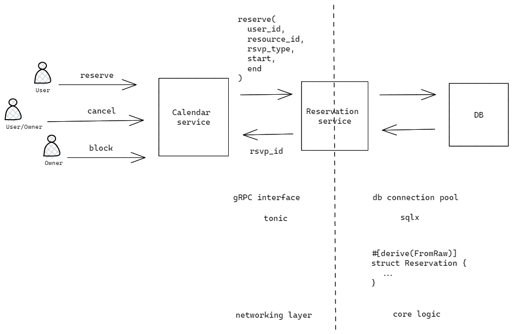

# Core Reservation

- Feature Name: core-reservation-service
- Start Date: 2022-11-05 19:34:47

## Summary

A core reservation service that solves the problem of reserving a resource for a period of time. We leverage postgres EXCLUDE constraints to ensure that only one reservation can be made for a given resource at a given time.

## Motivation

We need a common solution for various reservation requirements: 1) calendar booking; 2) hotel/room booking; 3) meeting room booking; 4) parking lot booking: 5) etc. Repeatedly building features for these requirements is a waste of time and resources. We should have a common solution that can be used by all teams.

## Guide-level explanation

Basic architecture:



### Service interface

We would use gRPC as a service interface. Below is the proto definition:

```proto
enum ReservationStatus {
    UNKNOWN = 0;
    PENDING = 1;
    CONFIRMED = 2;
    BLOCKED = 3;
}

enum ReservationUpdateType {
    UNKNOWN = 0;
    CREATE = 1;
    UPDATE = 2;
    DELETE = 3;
}

message Reservation {
    string id = 1;
    string user_id = 2;
    ReservationType rtype = 3;

    // resource reservation window
    string resource_id = 4;
    google.protobuf.Timestamp start = 5;
    google.protobuf.Timestamp end = 6;

    // extra note
    string note = 7;
}

message ReserveRequest {
    Reservation reservation = 1;
}

message ReserveResponse {
    Reservation reservation = 1;
}

message UpdateRequest {
    string note = 1;
}

message UpdateResponse {
    Reservation reservation = 1;
}

message ConfirmRequest {
    string id = 1;
}

message ConfirmResponse {
    Reservation reservation = 1;
}

message CancelRequest {
    string id = 1;
}

message CancelResponse {
    Reservation reservation = 1;
}

message GetRequest {
    string id = 1;
}

message GetResponse {
    Reservation reservation = 1;
}

message QueryRequest {
    string resource_id = 1;
    string user_id = 2;
    // use status to filter result. If UNKNOWN, return all rservations
    ReservationStatus status = 3;
    google.protobuf.Timestamp start = 4;
    google.protobuf.Timestamp end = 5;
}

service ReservationService {
    rpc reserve(ReserveRequest) returns (ReserveResponse);
    rpc confirm(ConfirmRequest) returns (ConfirmResponse);
    rpc update(UpdateRequest) returns (UpdateResponse);
    rpc cancel(CancelRequest) returns (CancelResponse);
    rpc get(GetRequest) returns (GetResponse);
    rpc query(QueryRequest) returns (stream Reservation);
    // another system could monitor newly added/conformed/cancelled reservations
    rpc listen(ListenRequest) returns (stream Reservation);
}
```

### Database schema

We use postgres as the database. Below is the schema:

```sql
CREATE SCHEMA rsvp;

CREATE TYPE rsvp.reservation_status AS ENUM('unknown','pending', 'coonfirmed', 'blocked');
CREATE TYPE rsvp.reservation_update_type AS ENUM('unknown','create', 'update', 'delete');

CREATE TABLE rsvp.reservation (
    id uuid NOT NULL DEFAULT uuid_generate_v4(),
    user_id VARCHAR(64) NOT NULL,
    status reservation_status NOT NULL DEFAULT 'pending',

    resource_id VARCHAR(64) NOT NULL,
    timespan TSTZRANGE NOT NULL,

    note TEXT,

    CONSTRAINT reservations_pkey PRIMARY KEY (id),
    CONSTRAINT reservations_conflict EXCLUDE USING gist (resource_id WITH =, timespan WITH &&)
);
CREATE INDEX reservations_resource_id_idx ON rsvp.reservations (resource_id);
CREATE INDEX reservations_user_id_idx ON rsvp.reservations (user_id);

-- if user_id is NULL, find all reservations within during for the resource
-- if resource_id is NULL, find all reservations within during for the user
-- if both are null, find all reservations within during
-- if both set, find all reservations within during for the resource and user
CREATE OR REPLACE FUNCTION rsvp.query(uid TEXT, rid TEXT, during TSTZRANGE) RETURNS TABLE rsvp.reservations AS $$ $$ LANGUAGE plpgsql;

-- reservation change queue
CREATE TABLE rsvp.reservation_changes (
    id SERIAL NOT NULL,
    reservation_id uuid NOT NULL,
    op rsvp.reservation_update_type NOT NULL,
);

-- triggerfor add/update/delete a reservation
CREATE OR REPLACE FUNCTION rsvp.reservations_trigger() RETURNS TRIGGER AS $$
BEGIN
    IF TG_OP = 'INSERT' THEN
        --
        INSERT INTO rsvp.reservation_changes (reservation_id, op) VALUES (NEW.id, 'create');
    ELSIF TG_OP = 'UPDATE' THEN
        --
        IF OLD.status <> NEW.status THEN
            INSERT INTO rsvp.reservation_changes (reservation_id, op) VALUES (NEW.id, 'update');
        END IF;
    ELSIF TG_OP = 'DELETE' THEN
        --
        INSERT INTO rsvp.reservation_changes (reservation_id, op) VALUES (NEW.id, 'delete');
    END IF;
    -- notify a channel called reservation_update
    NOTIFY reservation_update;
    RETURN NULL;
END;
$$ LANGUAGE plpgsql;

CREATE TTRIGGER reservations_trigger
    AFTER INSERT OR UPDATE OR DELETE ON rsvp.reservations
    FOR EACH ROW EXECUTE rsvp.reservations_trigger();
```

Here we use EXCLUDE constraint provided by postgres to ensure that on overlapping reservations cannot be made for a given resource at a given time.

```sql
CONSTRAINT reservations_conflict EXCLUDE USING gist (resource_id WITH =, timespan WITH &&)
```


We also use a trigger to notify a channel when a reservation is added/updated/deleted. To make sure we missed certain messages from the channel when DB connection is down for some reason, we use a queue to store reservation changes. Thus when we receive a notification, we can query the queue to get all the changes since last time we checked, and once we finished processing all the changes, we can delete them from the queue.

### Core flow


## Reference-level explanation

TBD

## Drawbacks

N/A

## Rationale and alternative

N/A

## Prior art

N/A

## Unresolved questions

- how to handle repeated reservations? - is this more ore less a business logic which shouldn't be put into this layer? (non-goal: we consider this is a business logic and should be handled by the caller)
- if load is big, we may use an external queue for recording changes.
- we haven't considered tracking/observability/deployment yet.
- query performance might be an issue - need to revisit the index and also consider using cache.
